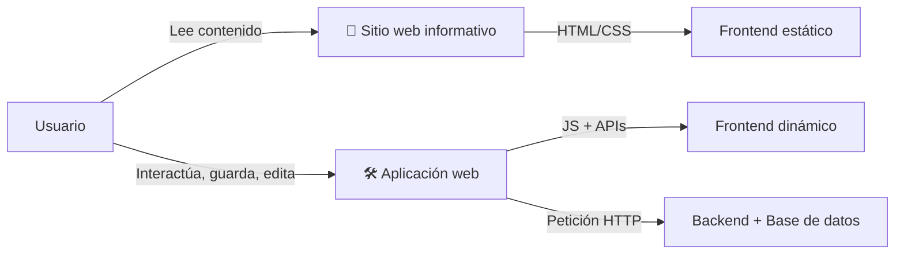

# ✅ ACTIVIDAD 1 – ¿Esto es una web o una app web?

**🎯 Objetivo:**  
Comprender la diferencia entre un **sitio web estático** y una **aplicación web interactiva**, a partir de ejemplos, análisis y reflexión sobre tecnologías web modernas.

---

## 1. Ejemplos de sitios web informativos (estáticos)

1. [Wikipedia](https://www.wikipedia.org)  
    

   ➤ Sitio colaborativo de artículos informativos que no requieren interacción avanzada del usuario.

2. [BBC News](https://www.bbc.com/news)  
    

   ➤ Portal de noticias que presenta información actualizada, pero de forma principalmente pasiva.

3. [MDN Web Docs](https://developer.mozilla.org)  
    
  
   ➤ Recurso educativo que ofrece documentación técnica. Aunque tiene buscador, no requiere login ni procesos dinámicos.

---

## 2. Ejemplos de aplicaciones web (interactivas)

1. [Figma](https://www.figma.com)  
    

   ➤ App colaborativa para diseño de interfaces. Permite edición en tiempo real, autenticación, y guardado dinámico.

2. [Notion](https://www.notion.so)  
      

   ➤ Aplicación de organización personal/empresarial. Guarda contenido en bases de datos y permite personalización.

3. [Canva Web](https://www.canva.com)  
      

   ➤ Plataforma de diseño gráfico online con carga y edición multimedia, integración con APIs y soporte en la nube.

---

## 3. ¿Por qué esta clasificación?

| Tipo              | Características clave                                              |
|-------------------|---------------------------------------------------------------------|
| **Sitios web**    | Contenido mayormente estático, lectura pasiva, sin login ni lógica compleja.|
| **Apps web**      | Requieren backend, manejo de estados, autenticación, lógica de negocio, guardado en tiempo real, etc. |

---

## 4. Reflexión: ¿Qué hace que una app web sea interactiva?

Una aplicación web interactiva:

- [x] Permite **interacción directa** con el contenido  
- [x] Cambia su estado sin recargar la página (SPA, AJAX)  
- [x] Usa lógica en frontend y backend  
- [x] Puede integrarse con servicios externos o APIs  
- [x] Maneja autenticación y roles de usuario  
- [x] Guarda datos en **bases de datos** y los recupera en tiempo real

### 🧪 Tecnologías detrás:

- **Frontend**: JavaScript, React, Vue, Angular  
- **Backend**: Node.js, Spring Boot, Django, Laravel  
- **Bases de datos**: PostgreSQL, MongoDB, Firebase  
- **Otros**: APIs REST, WebSockets, OAuth, JWT, GraphQL

---

## 📊 Diagrama comparativo (Mermaid)

