<h1 align="center">ACTIVIDAD 3 Explorando las herramientas de desarrollo</h1>

**🎯 Objetivo:**  
Familiarizarse con las **DevTools del navegador** para inspeccionar sitios web, analizar solicitudes, errores y estructuras HTML.

---

## ¿Cómo abrir las DevTools?

| Sistema operativo | Atajo para abrir DevTools           |
|-------------------|-------------------------------------|
| Windows|<kbd>F12</kbd> o <kbd>Ctrl</kbd> + <kbd>Shift</kbd> + <kbd>I</kbd>|
| Linux| <kbd>Ctrl</kbd> + <kbd>Shift</kbd> + <kbd>I</kbd>|
| macOS| <kbd>Cmd</kbd> + <kbd>Option</kbd> + <kbd>I</kbd>|

---

## 🛠️ DevTools

## 🔍 Pestañas principales a explorar

### 1. **Elementos (Elements)**
Permite ver y editar el HTML y CSS de cualquier elemento de la página.

### 2. **Consola (Console)**
Muestra mensajes del navegador, errores de JavaScript y permite escribir comandos directamente.

### 3. **Red (Network)**
Muestra todas las solicitudes HTTP/HTTPS que hace la página (APIs, imágenes, fuentes, etc.).

### 4. **Almacenamiento (Storage / Application)**
Permite ver cookies, Local Storage, Session Storage, IndexedDB y más.

---

## 👨‍💻 Ejercicio práctico

1. Abrir el navegador y visitá una web pública, por ejemplo: [https://www.google.com](https://www.google.com)

2. Usá las DevTools para inspeccionar lo siguiente:
   - ✅ Una **solicitud HTTP** en la pestaña Network (por ejemplo: `/search`)
   - ✅ Un **error en consola**, si aparece (puede ser una advertencia o error de script)
   - ✅ El **HTML de un elemento**, como el campo de búsqueda

3. Tomá capturas de pantalla y guardalas para compartirlas o incluirlas en tu entrega.

### Screenshot

  
*Figura: Solicitud HTTP en la pestaña Network.*

  
*Figura: Vista de la consola mostrando errores y advertencia.*

  
*Figura: Examinando elementos.*

---

## Diagrama conceptual

```mermaid
flowchart TD
    A["🌐 Página Web"]
    A --> B["🧰 DevTools"]
    B --> C["🔎 Elementos"]
    B --> D["💬 Consola"]
    B --> E["🌐 Red (Network)"]
    B --> F["🗄️ Almacenamiento"]
```

