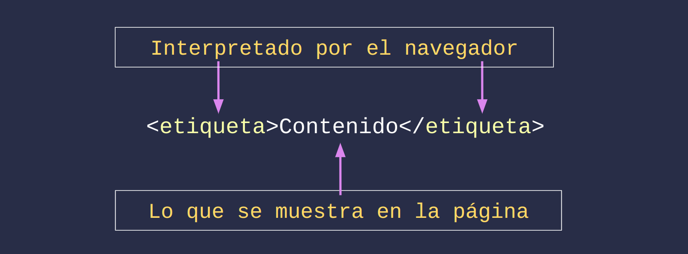

<h1 align="center">ACTIVIDAD 4<br/>Soy nuevo y aprendí Java… ¿y ahora qué con HTML, CSS y JS?</h1>

🎯 **Objetivo:**  
Dar una primera mirada a las tecnologías del desarrollo web: HTML, CSS y JavaScript, entendiendo su rol y cómo se diferencian de Java.

---

## Paso 1: ¿Qué hace cada tecnología?

### 🧱 HTML (HyperText Markup Language)

Es el **esqueleto de una página web**. Define su estructura, secciones, títulos, imágenes, formularios, enlaces, etc.

```html
<h1>Hola mundo</h1>
<p>Este es mi primer sitio web.</p>
```

Existen muchas etiquetas y cada una se utiliza para contener información y darle un cierto significado a dicha información, dependiendo de la etiqueta que se trate. Las etiquetas HTML tienen la siguiente estructura:



> [!IMPORTANT]
> Sin HTML, el navegador no sabe qué mostrar.

### 🎨 CSS (Cascading Style Sheets)

Es el maquillaje de la web. Se encarga de los estilos visuales: __colores__, __tipografías__, __espaciado__, __diseño responsive__, etc.

```css
h1 {
  color: tomato;
  text-align: center;
}
```

> [!IMPORTANT]
> Sin CSS, todo se ve plano y sin diseño.

### ⚙️ JavaScript

Es el cerebro de la página web. __Permite que sea interactiva__: responder a clics, mover elementos, validar formularios, cargar contenido dinámico, etc.

```javascript
document.querySelector("h1").onclick = () => {
  alert("¡Hola desde JavaScript!");
}
```

> [!IMPORTANT]
> Sin JavaScript, la página no reacciona al usuario

## Paso 2: Comparación entre Java y JavaScript

| Concepto         | Java                                             | JavaScript                          |
| ---------------- | ------------------------------------------------ | ----------------------------------- |
| Tipo de lenguaje | Compilado y tipado                               | Interpretado y dinámico             |
| Ejecución        | JVM (Java Virtual Machine)                       | Navegador o Node.js                 |
| Sintaxis         | Similar (usa llaves `{}` y variables)            | Parecida pero más flexible          |
| Uso principal    | Aplicaciones de escritorio, backend              | Web: frontend y backend con Node.js |
| Relación         | ¡El nombre es casual! Son tecnologías diferentes |                                     |

> [!NOTE]
> Aunque sus nombres suenan parecidos, Java y JavaScript no están directamente relacionados. Uno es más usado en sistemas grandes y backend, el otro es esencial para la web.